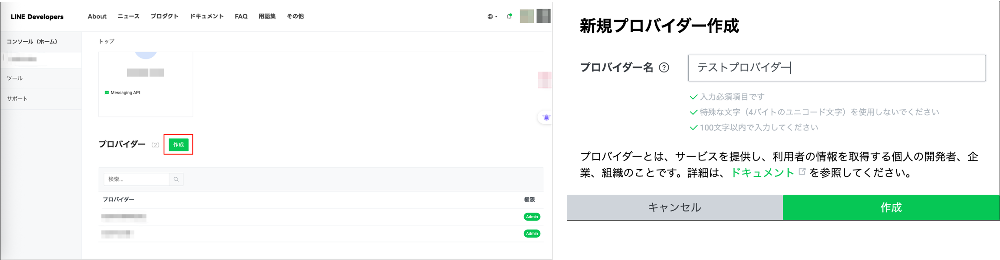
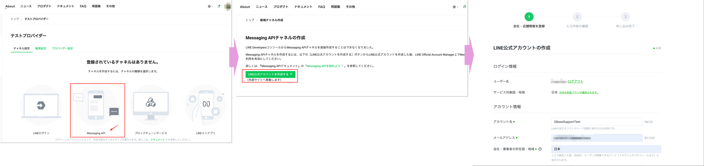
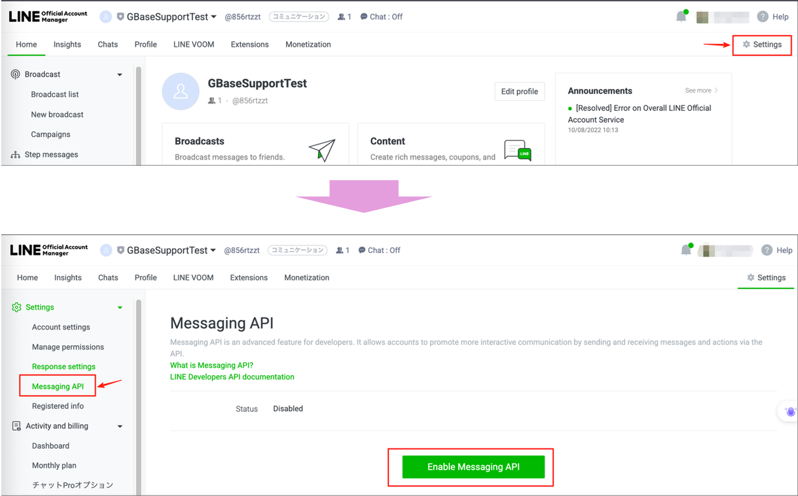
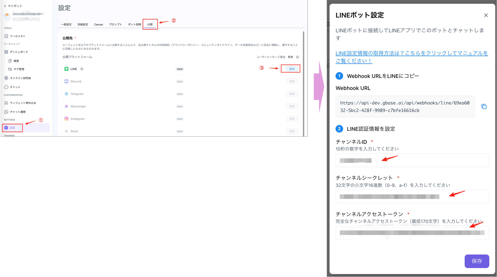
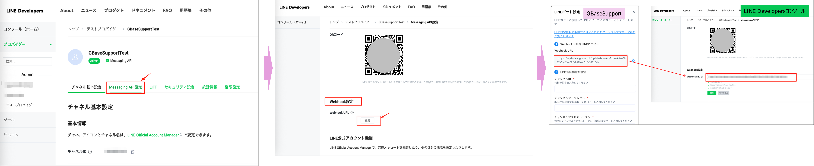
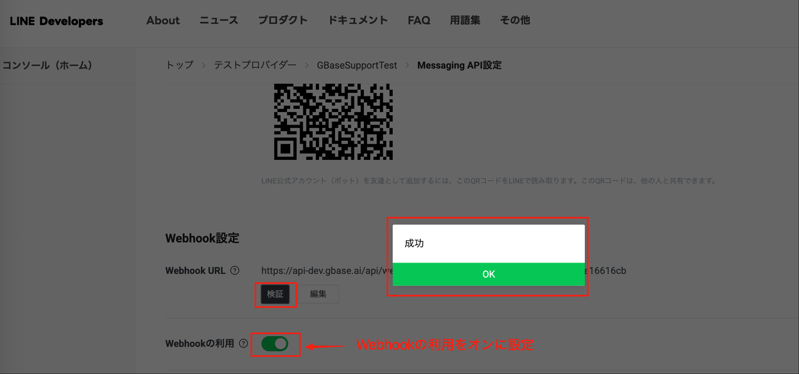
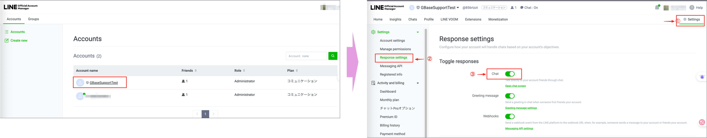
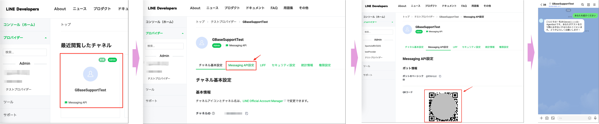

LINE連携を設定することで、GBaseSupportのチャットボットをLINE公式アカウントと連携させることができます。

## 事前準備

### 必要なアカウント
- [ ] LINEビジネスアカウントが作成されていること
- [ ] GBaseSupport管理画面にアクセスできること
- [ ] 管理者権限を持っていること

### 作業環境
- [ ] インターネット接続が安定していること
- [ ] スマートフォン（LINEアプリ）を用意すること
- [ ] 作業用PCのブラウザが最新版であること

## LINE連携設定手順

### ステップ1: LINEコンソールへのアクセス

1. [LINEビジネスアカウント](https://account.line.biz/login)にログインします
2. ログイン後、プロバイダー管理画面に移動します

### ステップ2: プロバイダーの作成

1. プロバイダー一覧で「作成」をクリックします
2. プロバイダー名を入力します
3. 「作成」ボタンをクリックして完了します

### ステップ3: Messaging APIチャネルの作成

1. 作成したプロバイダーを選択します
2. 「Messaging API」チャネルを新規作成します
3. 以下の必須情報を入力します：
   - **アカウント名**
   - **メールアドレス**
   - **会社・事業者の所在国・地域**
   - **業種**
   - **運用目的（複数選択可）**
   - **主な使い方**
   - **ビジネスマネージャーの組織との接続方法**

   
### ステップ4: Message APIの有効化

1. 新規作成した公式アカウントの「Settings」→「Message API」に移動します
2. 「Enable Message API」をクリックします
3. Message APIを有効化します

### ステップ5: API情報の確認と取得

#### チャネルIDとチャネルシークレットの確認
1. 同じ画面で「チャネルID」と「チャネルシークレット」を確認します
2. これらの情報を安全な場所に保存します

#### チャネルアクセストークンの発行
1. [LINE Developersコンソール](https://developers.line.biz/console/)にアクセスします
2. 新規作成したチャネルの「Message API設定」を選択します
3. 「チャネルアクセストークン」を発行します
4. 発行したトークンを安全な場所に保存します     

warning：これらの情報は後で必要になります。紛失しないよう注意してください。

### ステップ6: GBaseSupportでの連携設定

1. GBaseSupport管理画面にログインします
2. チャットボットの「設定」→「公開」を選択します
3. LINEの「設定」をクリックします
4. ステップ5で取得した情報を入力します：
   - **チャネルID**
   - **チャネルシークレット**
   - **チャネルアクセストークン**
5. 「保存」ボタンをクリックします

### ステップ7: Webhook設定

1. [LINE Developersコンソール](https://developers.line.biz/console/)にアクセスします
2. 新規作成したチャネルの「Message API設定」を選択します
3. Webhook設定の「編集」ボタンをクリックします
4. GBaseSupportの「LINEボット設定」画面で表示されているWebhook URLを入力します
5. 「更新」ボタンをクリックします
6. 「検証」ボタンをクリックして「成功」を確認します

warning：「Webhookの利用」をオンに設定する必要があります。

### ステップ8: 応答設定

1. [LINE Manager](https://manager.line.biz/)にアクセスします
2. 該当チャネルアカウントを選択します
3. 「Settings」→「Response settings」を選択します
4. 「Chat」をオンに設定します

## テストと確認

### 接続テスト

1. [LINE Developersコンソール](https://developers.line.biz/console/)にアクセスします
2. 新規作成したチャネルの「QRコード」を表示します
3. スマートフォンのLINEアプリでQRコードをスキャンします
4. チャネルを友達追加します
5. テストメッセージを送信します

### 確認項目
- [ ] メッセージが正常に送信できること
- [ ] GBaseSupportから応答が返ってくること
- [ ] 自動応答が正常に動作すること

## トラブルシューティング

### よくある問題

#### Webhook接続エラー
- **原因**: URLが不正、サーバーダウン、ファイアウォール
- **解決策**:
  1. Webhook URLが正しいか再確認
  2. GBaseSupportサーバーが稼働中か確認
  3. ファイアウォール設定を確認

#### メッセージ送信エラー
- **原因**: トークン無効、API制限、メッセージ形式不正
- **解決策**:
  1. アクセストークンが有効か確認
  2. API制限に達していないか確認
  3. メッセージ形式が正しいか確認

#### 応答遅延
- **原因**: サーバー負荷、ネットワーク問題
- **解決策**:
  1. サーバー負荷を確認
  2. ネットワーク接続を確認
  3. 設定内容を再確認

### サポート連絡先
- **技術サポート**: support@sparticle.com
- **営業時間**: 平日 10:00〜18:00
- **緊急連絡先**: 03-3527-2828

## セキュリティ注意事項

- APIキーやトークンは第三者に共有しないでください
- トークンは定期的に更新することを推奨します
- 不要になったトークンは直ちに無効化してください
- Webhook URLは安全なHTTPS接続を使用してください

## 用語集

- **Messaging API**: LINEが提供するメッセージ送受信API
- **Webhook**: 外部サービスからの通知を受け取る仕組み
- **アクセストークン**: API認証に使用するトークン
- **チャネルシークレット**: Webhookの検証に使用するシークレットキー
- **プロバイダー**: LINE公式アカウントを管理する単位

## 参考リンク

- [GBaseSupportヘルプセンター](https://cs.gbase.ai/contact)
- [LINE Messaging APIドキュメント](https://developers.line.biz/ja/reference/messaging-api/)
- [LINE公式アカウント管理画面](https://manager.line.biz/)
- [LINE Developersコンソール](https://developers.line.biz/console/)
